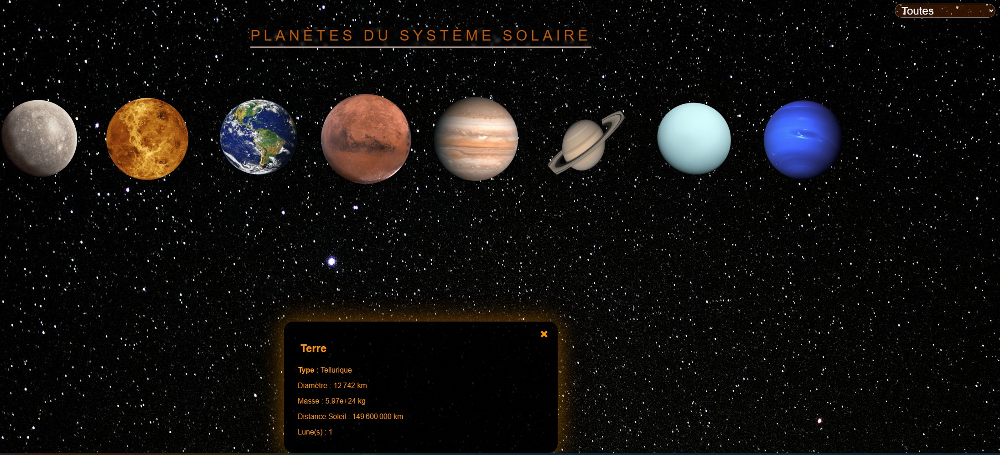

# ActuNews

*[Version française disponible ici](README.fr.md)*

ActuNews is a news website about astronomy and space exploration, built as my "fil rouge" project during my DWWM training. The idea was to practice a full stack from scratch: a small hand rolled MVC in PHP, a MySQL database I designed myself, and a front end that goes a bit further than a plain article list, with an interactive planetarium page.

## What it does

On the public side, visitors can browse published articles, filter them by category, and open a full article page with its date, author and content. There's a registration and login system with sessions, and a "Planétarium" page that's a bit more experimental: a starfield background drawn on canvas, a horizontal strip of planets you can scroll through and click, a small modal with each planet's type, diameter, mass, distance to the Sun and number of moons, a timeline showing distances to the Sun to scale, and a band of fun facts. The whole site is responsive, and the header collapses into a hamburger menu below 1120px wide.

Logged in as an admin or an author, you get access to a back office where you can create, edit and delete articles, upload an image for each one, and assign categories through a many to many relationship. Admins can also manage user roles.

## How it's built

There's no framework here, it's a small MVC I put together myself: `App\Controllers`, `App\Models`, `App\Views` and `App\Core` (which holds the database connection, the view renderer, the auth helper and the image uploader). Database credentials live in a `.env` file loaded with `vlucas/phpdotenv`, and all queries go through PDO with prepared statements. On the front end it's plain JavaScript, mostly the Canvas API for the starfield and DOM manipulation for the planetarium and the category filters, no JS framework involved.

**Stack:** PHP 8, MySQL / PDO, Composer, vanilla JavaScript (Canvas API), HTML5 / CSS3 (Grid, Flexbox), Git.

## Database

The schema has eight tables: `users`, `categories`, `articles`, `article_categories` (the join table between articles and categories), `commentary`, `forms`, `planets` and `systems`. The full schema is in `SQL/bdd.sql`, and `SQL/articles_demo.sql` seeds a dozen demo articles if you want the site to look populated right away.

## Running it locally

You'll need PHP 8, MySQL and Composer. Clone the repo, run `composer install`, then copy `.env.example` to `.env` and fill in your database host, name, user and password. Import `SQL/bdd.sql` into MySQL to create the schema, and optionally `SQL/articles_demo.sql` to add sample articles. Drop the project into your local server's web root (I use XAMPP) and point your browser at `public/index.php`.

## About me

I'm Maxime Paulin, a web developer who just finished a DWWM qualification and is now continuing with a CDA (Concepteur Développeur d'Applications) training at CESI. I'm looking for a work study placement for next year.

[LinkedIn](https://www.linkedin.com/in/maxime-paulin-968ab1266/) · [GitHub](https://github.com/meagle-pixel)
